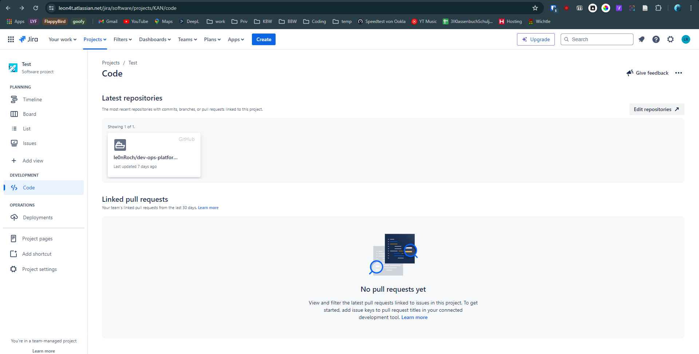

# DevOps Plattform

## Übersicht

## Plattformen im Vergleich

| Plattform                                                          | Planing | Repos                    | CI/CD | Monitoring & Logging | Security | Cloud             |
| ------------------------------------------------------------------ | ------- | ------------------------ | ----- | -------------------- | -------- | ----------------- |
| [Azure DevOps](https://azure.microsoft.com/de-de/services/devops/) | Ja      | Ja                       | Ja    | Ja                   | Ja       | Ja                |
| [AWS](https://aws.amazon.com/)                                     | Nein    | Ja                       | Ja    | Ja                   | Ja       | Ja                |
| [Google Cloud](https://cloud.google.com/)                          | Nein    | Ja                       | Ja    | Ja                   | Ja       | Ja                |
| [Jenkins](https://www.jenkins.io/)                                 | Nein    | Ja (Artifact Repository) | Ja    | Ja                   | Ja       | Nein              |
| [DigitalOcean](https://www.digitalocean.com/)                      | Nein    | Ja (Container Registry)  | Ja    | Ja                   | Ja       | Ja                |
| [IBM Cloud](https://www.ibm.com/cloud)                             | Nein    | Ja (Container Registry)  | Ja    | Ja                   | Ja       | Ja                |
| [Hetzner Cloud](https://www.hetzner.com/cloud)                     | Nein    | Nein                     | Nein  | Ja                   | Ja       | Ja                |
| [Tencent Cloud](https://intl.cloud.tencent.com/)                   | Ja      | Ja                       | Ja    | Ja                   | Ja       | Ja                |
| [Atlassian](https://www.atlassian.com/software/jira)               | Ja      | Ja (Bitbucket)           | Ja    | Ja                   | ?        | Ja (AWS)          |
| [GitLab](https://about.gitlab.com/)                                | Nein    | Ja                       | Ja    | Ja                   | Ja       | Ja (Nur Frontend) |

## Atlasian unter der Lupe

### Jira

Jira besitzt ein Board, womit man seine Kanban oder Scrum Prozesse abbilden kann.

Jira kann mit einem Repository verknüpft werden, um die Commits und Pull Requests zu sehen.
